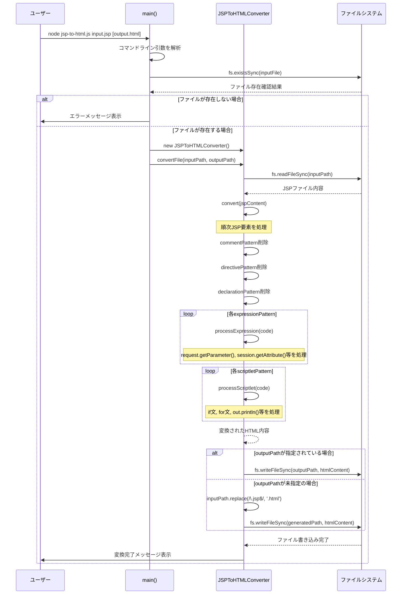

# CLAUDE.md

This file provides guidance to Claude Code (claude.ai/code) when working with code in this repository.

## JSP to HTML 変換ツール

このリポジトリはJSP（JavaServer Pages）ファイルを静的HTMLファイルに変換するツールです。Node.js環境とWebブラウザ環境の両方で動作し、CSSファイルの自動参照機能も提供します。

### 提供される2つのバージョン

1. **Node.js版** (`jsp-to-html.js`): コマンドライン実行環境
2. **Webブラウザ版** (`jsp-to-html-web.html`): ブラウザ上で動作するGUI版

### アーキテクチャ

変換処理は `JSPToHTMLConverter` クラスで実装されており、両バージョンで同じ変換ロジックを共有しています：

#### JSP構文要素の処理：
- `<%-- --%>` (コメント) - 完全に削除
- `<%@ %>` (ディレクティブ) - 完全に削除
- `<%! %>` (宣言) - 完全に削除
- `<%= %>` (式) - プレースホルダーテキストまたは抽出された値に変換
- `<% %>` (スクリプトレット) - HTMLコメントに変換

#### JSP式の処理：
- `request.getParameter()` 呼び出しを `[パラメータ名]` プレースホルダーに変換
- `session.getAttribute()` 呼び出しを `[session:属性名]` プレースホルダーに変換
- クォートされた式から文字列リテラルを抽出
- その他の式を `[expression]` 形式でラップ

#### スクリプトレットの処理：
- HTMLコメントに変換、`out.println()` 文は特別処理

#### CSS参照機能：
- `<%-- css: filename1.css, filename2.css --%>` コメント形式の指定を認識
- `<c:set var="css_file_names" value="file1.css,file2.css" />` タグ形式の指定を認識  
- スクリプトレット内の `String cssFiles = "file1.css,file2.css"` 形式を認識
- ファイル名のみ指定時は自動的に `css/` フォルダパスを追加
- 重複したCSS指定を自動除去
- 生成されるHTMLの `<head>` タグ内に `<link rel="stylesheet">` タグを自動挿入

### ツールの実行

#### Node.js版
```bash
# JSPファイルをHTMLに変換（出力ファイルは自動生成）
node jsp-to-html.js input.jsp

# 特定の出力ファイル名で変換
node jsp-to-html.js input.jsp output.html
```

#### Webブラウザ版
```bash
# Webブラウザでjsp-to-html-web.htmlを開く
open jsp-to-html-web.html
```
- JSPファイルのアップロード機能
- テキストエリアでの直接入力・編集
- リアルタイム変換とプレビュー表示
- 変換結果のHTMLファイルダウンロード
- ソースコード表示とプレビュー表示のタブ切り替え

### サンプルファイル

- `sample.jsp` と `sample2.jsp` - 基本的なJSP構文要素を示すテストファイル
- `sample-with-css.jsp` - CSS参照機能を示すテストファイル
- `sample.html`、`sample2.html`、`sample-with-css.html` - 生成されたHTML出力ファイル
- `css/main.css` と `css/layout.css` - サンプル用CSSファイル

### 処理シーケンス図



### テスト方法

#### Node.js版のテスト：
```bash
# 基本的なJSP変換テスト
node jsp-to-html.js sample.jsp

# CSS参照機能のテスト
node jsp-to-html.js sample-with-css.jsp
```
1. 生成されたHTMLファイルが適切に変換されたコンテンツを含むことを確認
2. JSP構文が適切に処理されていることを確認（コメント削除、式のプレースホルダー変換など）
3. CSS参照機能で `<link rel="stylesheet">` タグが正しく挿入されることを確認

#### Webブラウザ版のテスト：
1. `jsp-to-html-web.html` をWebブラウザで開く
2. サンプルJSPコードを入力エリアに貼り付けまたはJSPファイルをアップロード
3. 「変換実行」ボタンをクリックして変換結果を確認
4. プレビュータブでスタイル適用結果を確認
5. HTMLファイルダウンロード機能の動作確認

#### CSS参照機能のテスト：
JSP内に以下の形式でCSS指定を追加してテスト：
```jsp
<%-- css: main.css, layout.css --%>
<c:set var="css_file_names" value="styles.css,theme.css" />
<%
    String cssFiles = "custom.css,responsive.css";
%>
```